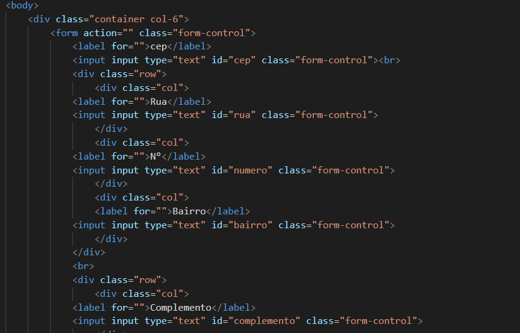
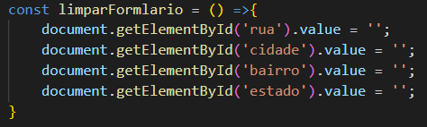
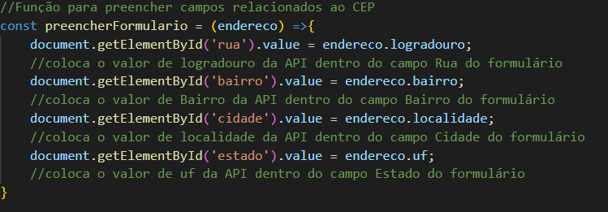
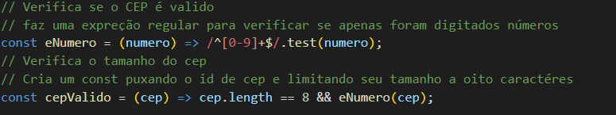
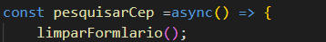
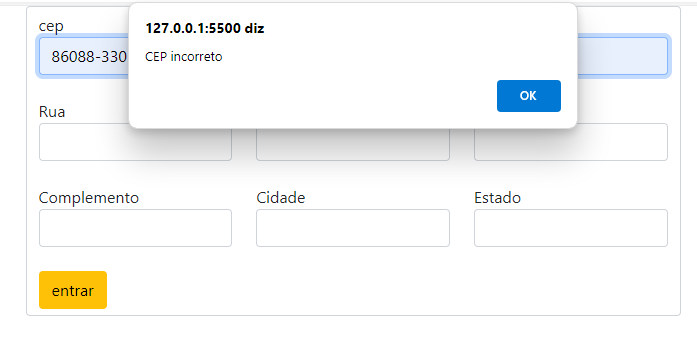
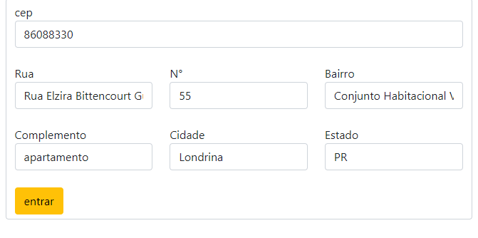

# Formulário de Cadastro de Endereço com Consumo de API (ViaCEP)

## Estrutura do projeto

HTML5: Para a estrutura do formulário.
Bootstrap 5: Para o layout responsivo e componentes visuais como inputs e botões.
JavaScript: Para a lógica do formulário, consumo da API e validação dos dados.
ViaCEP API: Para a busca de informações de endereço com base no CEP informado pelo usuário.

## Descrição do Projeto

Este projeto é um formulário de cadastro de endereço simples que utiliza a [API ViaCEP](https://viacep.com.br/) para buscar automaticamente informações de endereço a partir do CEP informado pelo usuário. Ele inclui campos para CEP, rua, número, bairro, complemento, cidade e estado. A integração com a API do ViaCEP permite que o usuário preencha apenas o CEP, e o formulário será automaticamente populado com os dados de endereço correspondentes, como rua, bairro, cidade e estado.
Funcionalidades

1 Busca Automática de Endereço: O usuário digita o CEP, e os campos de endereço (rua, bairro, cidade e estado) são automaticamente preenchidos utilizando a API ViaCEP.
2 Validação de CEP: O formulário valida se o CEP inserido possui 8 dígitos numéricos antes de consultar a API.
3 Limpeza de Formulário: O formulário é limpo sempre que uma nova busca de CEP é realizada.

#Estrutura do HTML

&lt;!DOCTYPE html&gt;
Define o tipo de documento como HTML5.

meta charset='utf-8'
Define o conjunto de caracteres como UTF-8, garantindo compatibilidade com caracteres especiais.

link href="https://cdn.jsdelivr.net/npm/bootstrap@5.0.2/dist/css/bootstrap.min.css" ...
Inclui a biblioteca Bootstrap 5 via CDN para estilização dos componentes de formulário.

Estrutura do Formulário

O formulário está organizado dentro de um container centralizado:
• CEP: Campo de input para o usuário inserir o CEP.
• Rua, Número, Bairro, Complemento, Cidade, Estado: Campos de input que serão preenchidos automaticamente ou manualmente.
• Botão de Enviar: Um botão estilizado para submeter os dados.

### Logica do JavaScript

O arquivo JavaScript contém a lógica para interação com a API ViaCEP e manipulação do DOM. Abaixo estão as principais funções:
1 Limpar Formulário (limparFormulario):
◦ Função que limpa os campos do formulário antes de realizar uma nova consulta.

### Limpar formulario (limparFormulario)

Função que limpa os campos do formulario antes de realizar uma nova consulta

### Preencher o formulario (preencherFormulario)

Preenche os campos de rua, bairro, cidade e estado com os dados retornados pela API ViaCEP

### Validação do CEP (cepValido)

Valida se o CEP contem 8 dígitos é numérico antes de enviar a requisição para a API

### Pesquisa de CEP (pesquisarCep)

Faz a chamda assíncrona á API ViaCEP, obém os dados do endereço e preenche o formulário.
Se o CEP for inválido ou não encontrado, exibe uma mensagem de erro.

#### Recursos da função

- async - A declaração async function define uma função assíncrona, que retorna um objeto
- hasOwnProperty - O método hasOwnProperty()retorna um booleano indicando se o objeto possui uma propriedade especificada como uma propriedade definida no próprio objeto em questão (ao contrário de uma propriedade herdada).
- await - A expressão await faz a execução de uma função async pausar, para esperar pelo retorno da Promise, e resume a execução da função async quando o valor da Promise é resolvido. Ele então retorna o valor final da Promise. Se esse valor não for uma Promise, ele é convertido para uma Promise resolvida.
- focusout - O evento focusouté acionado assim que o elemento perde o foco. A principal diferença entre esse evento e o evento bluré que esse último não gera "borbulhas".

# IMAGENS DO PROJETO

## Referências

[Código fonte](https://viacep.com.br/exemplo/javascript/)  
[Funções assíncronas](https://developer.mozilla.org/pt-BR/docs/Web/JavaScript/Reference/Statements/async_function)